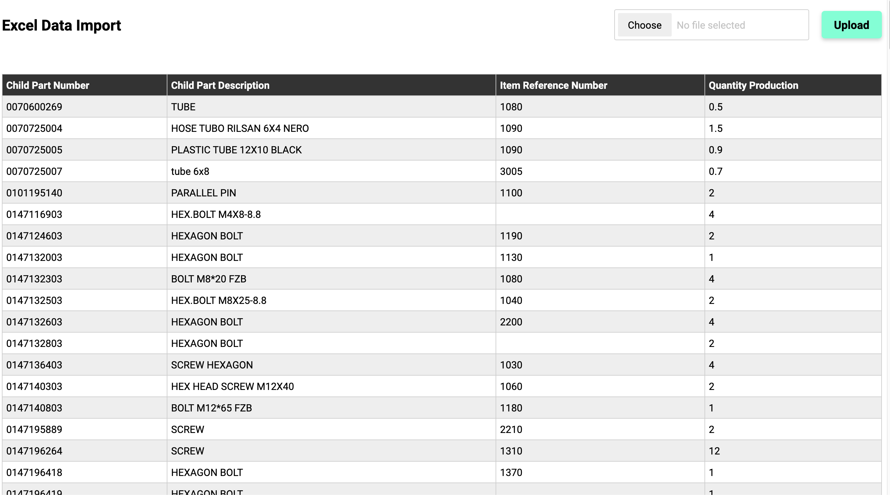

# Actualize Consulting Engineers Assignment
`
Create a simple Web App where people can upload the excel file and show the result in JSON format and store the data in the database.
Please make sure you use VS Code, Javascript, HTML/CSS, Python, database
`

## Requirements:
- Upload button need to be created
- After upload the excel file need to be read as JSON format
- JSON data need to be stored in any of the database
- After each upload data need to add in the database

## Sample Input file
[Example_file.xlsx](input/Example_file.xlsx)

# Tech Stack Used
Web App is developed using following technologies

- ReactJS
- Firestore (Google cloud platform)

## Plugins used

- xlsx
- firebase

# Sample output

